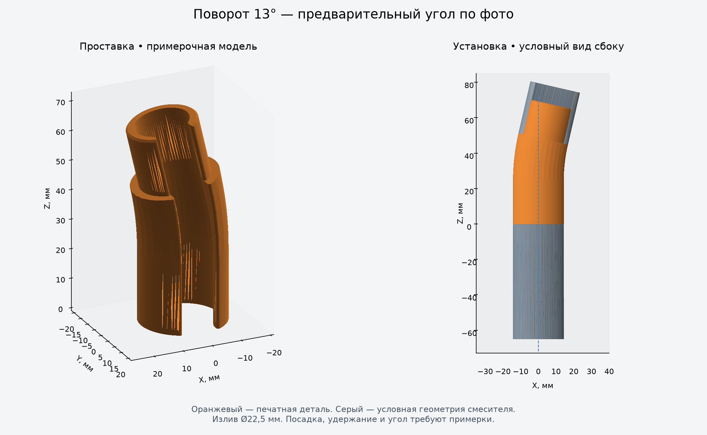
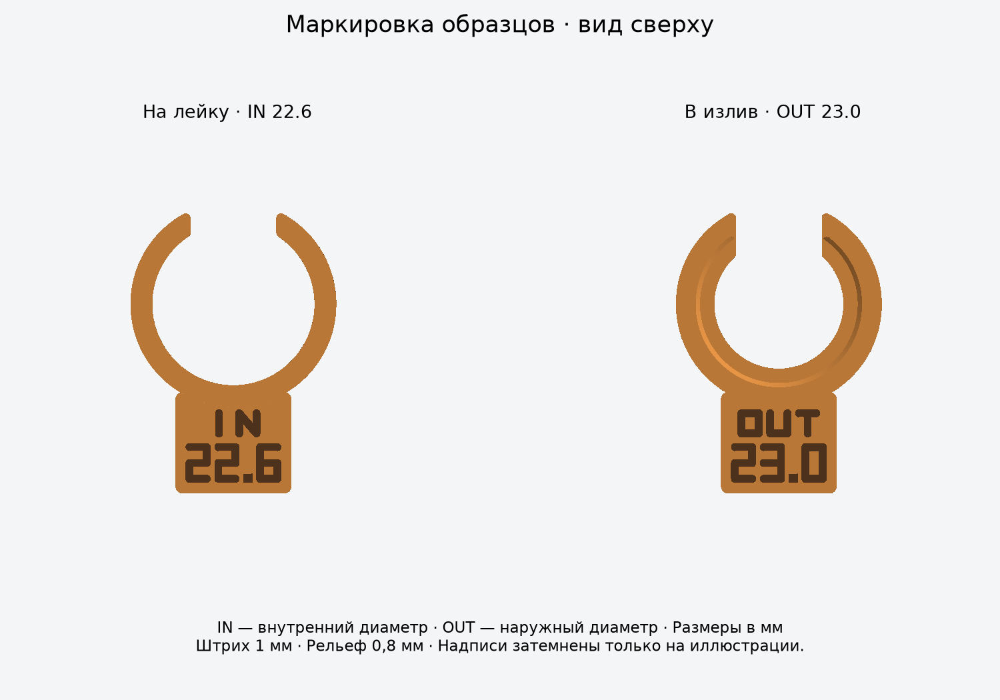

# Вариант v2 для согласования — 18.09.2026

Пользователь выбрал верхний образец **OUT 23.0**. Нижняя посадка **IN 22.6**
подтверждена ранее. Подготовлен отдельный вариант с уменьшенным корпусом и
скруглённым пазом: [STL](output/flush_v2/adapter_prototype.stl),
[STEP](output/flush_v2/adapter_prototype.step),
[параметры](parameters_flush_v2.json).
Прежние файлы в корне `output/` сохранены для сравнения и относятся к прошлой серии.



## Предлагаемые изменения

| Параметр | Предыдущая версия | Вариант v2 |
|---|---:|---:|
| Наружный диаметр корпуса | 30,5 мм | **28,5 мм** |
| Верхняя посадка полной детали | 22,5 мм, устаревший размер | **23,0 мм**, выбран по образцу |
| Нижняя посадка | 22,6 мм | 22,6 мм |
| Ширина бокового паза | 13 мм | **12 мм** |
| Продольные углы паза | Острые | **R0,6 мм**, наружные и внутренние |
| Внутреннее сужение | Сосредоточено в конце изгиба | Плавно распределено по изгибу |

Корпус совпадает по номинальному диаметру с изливом и лейкой в местах стыков;
прежняя наружная ступенька 1 мм на сторону убрана. Это не герметичный стык:
реальная печать и подвижная лейка оставляют зазоры. Изгиб выступает в сторону
от нижней оси, поэтому общий габарит по X около 32,6 мм не означает диаметр 32,6 мм.
Поверхность в зоне изгиба аппроксимируется CAD-лофтом между круговыми сечениями.

Паз 12 мм оставляет номинально 1 мм относительно мягкого шланга Ø11 мм.
Скругления снимают углы, сохраняя ширину узкой части паза. Адаптер надевается
сбоку на мягкий участок шланга: жёсткий буртик Ø12 мм через паз с нулевым зазором
пропускать не предполагается. Торцы имеют прежние входные фаски 0,6 мм;
R0,6 относится именно к продольным краям паза, а не ко всем рёбрам детали.

Прямой участок нижнего гнезда по-прежнему 24 мм, хвостовик 20 мм,
расстояние между торцами лейки и излива 48 мм, угол 13° по фото.
Внутреннее сужение начинается выше прямого гнезда; его конечный проход Ø18 мм.
Длину жёсткого соединителя не измеряли, поэтому свободный изгиб шланга и отсутствие
упора соединителя проверяются на полной детали.

## Печать соплом 0,4 мм

Номинальная радиальная толщина вдали от скруглений паза:

| Участок | Толщина |
|---|---:|
| Нижнее гнездо | **2,95 мм** |
| Край нижней входной фаски | 2,35 мм |
| Верхний хвостовик | **2,50 мм** |
| Край верхней входной фаски | 1,90 мм |

Эти размеры допускают несколько линий экструзии соплом 0,4 мм. Они не являются
расчётом прочности или доказанной минимальной толщиной во всех точках скруглений.
Уменьшение корпуса ослабляет нижнее разрезное кольцо; более узкий паз и смена
материала тоже меняют его упругость. Старые результаты примерки не гарантируют
одинаковую силу удержания новой детали.

Ориентация: **широким нижним торцом на стол, хвостовиком вверх**, как экспортировано.
Так кольцо пружинит преимущественно в плоскости слоёв. Изгиб всей проставки
при рывке лейки всё равно нагружает связи между слоями.

Проверка нормалей STL после сглаживания внутреннего перехода дала максимум
**16,65° от вертикали** для нависающих поверхностей выше нижней фаски.
Площадь таких поверхностей круче 45° — **0 мм²**. Контакт со столом и зона
нижней входной фаски до Z=0,61 мм исключены из этой оценки. Нижняя фаска имеет
наклон 45°. По этой геометрии поддержки не требуются. Это анализ поверхности,
а не проверка траекторий, охлаждения и качества конкретного профиля слайсера.

Стартовые настройки для Bambu Studio:

- Сопло 0,4 мм, масштаб **100%**, слой **0,2 мм** для примерки или **0,16 мм**
  для более гладкой внешней поверхности.
- **4 периметра**, 5 верхних и нижних слоёв, заполнение 30%. В тонких стенках
  большую часть сечения займут периметры; заполнение 100% не обязательно.
- Поддержки выключены; перед печатью проверить послойный предпросмотр.
- При необходимости кайма 4–5 мм, особенно для высокой полной детали.
- Шов разместить со стороны паза, по возможности вне основных посадочных дуг.
  Сохранить проверенную компенсацию первого слоя и не масштабировать деталь
  для исправления посадки.
- Температуры, обдув и подготовка пластины — по профилю конкретного филамента
  и принтера. Модель Bambu Lab и марка филамента пока не указаны.

Маркировка образцов сохранена: штрих 1 мм, квадратная точка 1,2 мм,
выпуклый рельеф 0,8 мм. При слое 0,2 мм это четыре слоя над площадкой.

## PLA или PETG

**Предлагаю PETG для рабочей детали, PLA оставить для примерок.** Для разрезного
зажима полезны вязкость, хорошее сцепление слоёв и более высокая температурная
стойкость PETG. PLA проще печатать, но он более хрупкий и хуже переносит нагрев;
для постоянно нагруженной посадки рядом с горячим краном это нежелательно.
Свойства описаны в руководствах производителя:
[PETG](https://help.prusa3d.com/article/petg_2059),
[PLA](https://help.prusa3d.com/article/pla_2062).

Это выбор материала для следующего прототипа, а не гарантия долговременного
удержания. При нагреве и длительной нагрузке посадка может ослабевать.
PETG обычно хуже переносит нависания и чаще даёт нити, поэтому здесь полезны
пологий внутренний переход и сухой филамент по инструкции его производителя.
После смены PLA на PETG посадку нужно проверить заново.

## Что напечатать следующим

Перед полной деталью напечатать в выбранном материале два компактных образца:

- [OUT 23.0 v2](output/flush_v2/pin_gauge_OD_23.0.stl) — паз 12 мм, R0,6,
  полная длина посадки 20 мм и ограничительный фланец Ø28,5 мм.
- [IN 22.6 v2](output/flush_v2/socket_gauge_ID_22.6.stl) — новая толщина стенки,
  паз 12 мм и R0,6. Короткое кольцо экономит материал, но не проверяет скольжение
  лейки по всей глубине 24 мм.



Надписи обозначают размеры, а не ревизию. Не смешивать эти образцы со старыми:
у новых ширина паза 12 мм, видны скругления, наружный фланец 28,5 мм.
Выбранные Ø23,0 и Ø22,6 сохраняем до результатов проверки новой геометрии.
После печати полной детали проверить удержание при извлечении лейки,
отсутствие проворота, свободный шланг и направление струи.

## Воспроизведение и проверка

В VS Code: **Terminal → Run Task → OCP: Show flush rounded v2 proposal**.
Стандартная задача Ctrl+Shift+B пока показывает прежний вариант для сравнения.
Для новой версии из терминала в папке проекта:

```powershell
& .\.venv\Scripts\python.exe model.py --parameters parameters_flush_v2.json --output-dir output/flush_v2 --view
& .\.venv\Scripts\python.exe verify_exports.py --output-dir output/flush_v2
& .\.venv\Scripts\python.exe analyze_print.py --output-dir output/flush_v2
```

Все три STEP прошли проверку валидности единого тела; все три STL — проверку
замкнутости, связности, согласованности ориентации и объёма относительно STEP.
Отчёты: [геометрия](output/flush_v2/geometry_report.json),
[экспорт](output/flush_v2/export_validation.json),
[печать](output/flush_v2/print_analysis.json).
Пересечение хвостовика с условным изливом в отчёте ожидаемо: CAD Ø23,0 больше
измеренного отверстия Ø22,5. Это номинальный натяг; упругая деформация и реальные
печатные размеры в CAD-сборке не моделируются.
