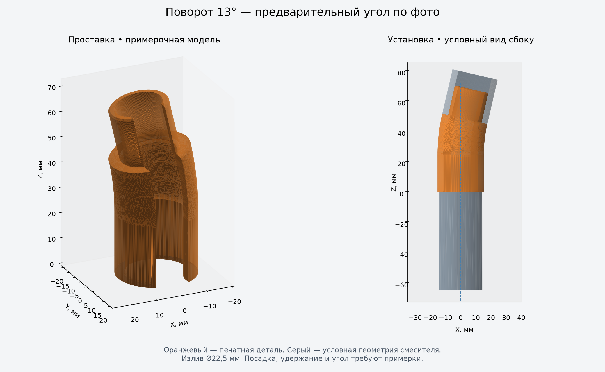

# Проставка для кухонного смесителя

Параметрическая модель CadQuery, которая меняет наклон выдвижной лейки,
чтобы направить струю вертикально. Текущий вариант рассчитан на коррекцию **13°**
по фотографии и посадочную часть лейки **Ø22 × 23 мм**.



**Состояние проекта:** модель создана, STEP/STL проверены, пользователь подтвердил
просмотр и вращение модели в OCP CAD Viewer. Физическая примерка ещё не выполнена.
Внутренний диаметр излива измерен: **22,5 мм**. Цель — плотная верхняя посадка
адаптера и свободное скольжение лейки в нижней. Надёжность удержания и фактическое
направление струи предстоит проверить. STL уточнён после замечания о видимых гранях.

## Что сохранено

- [model.py](model.py) — исходник модели; [parameters.json](parameters.json) — размеры.
- [Фото референсы](<Фото референсы/>) — все четыре исходные фотографии с замерами.
- [output](output/) — полная проставка и семь посадочных образцов в STL/STEP,
  условная сборка, изображение и отчёты проверок.
- [DESIGN.md](DESIGN.md) — конструкция, допущения, порядок примерки и печати.
- `.vscode/` — настройки Python/OCP CAD Viewer и запуск через Ctrl+Shift+B.
- `pyproject.toml`, `uv.lock`, `.python-version` — воспроизводимое Python-окружение.

Папки `.venv`, кэши и временные диагностические установки в Git не включены:
окружение создаётся заново на другом компьютере из `uv.lock`.
STL уже можно открыть в Bambu Studio без установки CadQuery.

## Открыть на другом компьютере: Windows / PowerShell

Нужны Git, [uv](https://docs.astral.sh/uv/getting-started/installation/) и VS Code.
Для доступа к приватному репозиторию войти в свой аккаунт GitHub.

```powershell
git clone https://github.com/flavius-aetios/faucet-cad.git
Set-Location faucet-cad
uv sync --locked --cache-dir .uv-cache
code --install-extension ms-python.python
code --install-extension ms-toolsai.jupyter
code --install-extension bernhard-42.ocp-cad-viewer
code .
```

`uv` создаёт `.venv` с Python 3.11 и версиями библиотек из lock-файла.
Путь клонирования может быть любым: настройки проекта используют `${workspaceFolder}`.
Открывать в VS Code нужно **папку проекта**, чтобы её настройки применились.

1. Если VS Code не выбрал Python автоматически, выполнить `Python: Select Interpreter`
   и выбрать `.venv\Scripts\python.exe` внутри клонированной папки.
2. Открыть `model.py`: справа должен открыться OCP CAD Viewer.
3. Нажать **Ctrl+Shift+B** → **OCP: Show faucet adapter**. Открытие исходника само
   по себе не отправляет модель; задача выполняет программу с `--view`.

Альтернатива из терминала в папке проекта:

```powershell
& '.\.venv\Scripts\python.exe' '.\model.py' --view
```

Для генерации файлов без Viewer и проверки результата:

```powershell
& '.\.venv\Scripts\python.exe' '.\check_environment.py'
& '.\.venv\Scripts\python.exe' '.\model.py'
& '.\.venv\Scripts\python.exe' '.\verify_exports.py'
```

Сохранённые отчёты относятся к исходному компьютеру; эти команды обновляют их
по результатам проверок на новом компьютере.

## Уже исправленные проблемы окружения

- **Python падает при завершении:** на Windows совместная загрузка CasADi 3.8.0
  и NLopt 2.11.0 приводила к `0xC0000005`. Зафиксирована проверенная пара
  **CasADi 3.8.0 / NLopt 2.9.1**. Использовать `uv sync --locked`, чтобы сохранить её.
- **PowerShell: неожиданный токен `-m`:** расширению задан префикс `& ` через
  `OcpCadViewer.advanced.shellCommandPrefix`. После изменения настроек выполнить
  `Developer: Reload Window`. В ручных командах перед путём к Python в кавычках
  также нужен `&`.
- **В Viewer логотип OCP:** выполнить `model.py --view` или Ctrl+Shift+B.

Инструкции и настройки VS Code проверены на Windows с PowerShell. При переносе
на Linux/macOS путь к Python — `.venv/bin/python`; нужно также изменить Windows-путь
в `.vscode/tasks.json`/`settings.json` и убрать PowerShell-префикс `& `.

## Следующий шаг: примерка на Bambu Lab с PLA

Для начала напечатать:

- [socket_gauge_ID_22.4.stl](output/socket_gauge_ID_22.4.stl) — посадка на лейку.
- Верхние образцы [Ø22,3](output/pin_gauge_OD_22.3.stl),
  [Ø22,4](output/pin_gauge_OD_22.4.stl), [Ø22,5](output/pin_gauge_OD_22.5.stl),
  [Ø22,6](output/pin_gauge_OD_22.6.stl) — плотная посадка в излив.
  Длина хвостовика каждого образца 20 мм, как у полной детали; примерять от меньшего к большему.

На всех образцах есть выпуклые подписи: **IN** — внутренний диаметр,
**OUT** — наружный, затем размер в миллиметрах. Образцы можно печатать вместе
на одной пластине и различать по надписям. [Пример маркировки](output/labeled_samples.png).

Для сопла 0,4 мм: слой 0,2 мм, 4 стенки, масштаб 100%. Проверить каждый образец
рукой без запрессовки: не входит / входит плотно / есть люфт. По результату изменить
зазоры в `parameters.json`, затем пересоздать полную модель.

Адаптер должен оставаться в изливе при извлечении лейки. Отдельной защёлки пока нет:
верхняя посадка удерживается трением, возвратный шланг возвращает лейку в адаптер.
PLA выбран пользователем для первой примерки; остальные
ограничения и порядок установки описаны в [DESIGN.md](DESIGN.md).

## Сохранить дальнейшие изменения

После изменения размеров и повторной генерации:

```powershell
git add .
git commit -m "Update adapter dimensions and printable models"
git push
```

На другом компьютере перед началом работы: `git pull`, затем
`uv sync --locked --cache-dir .uv-cache`.
